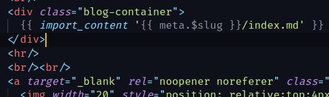
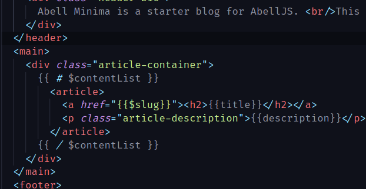

# Abell Language Features

Syntax Highlighting for .abell files to make abell specific commands like import_content and mustache syntax easier to read.

  

## Features

- Syntax Highlighting for .abell files

## Release Notes

Release notes are mentioned in [CHANGELOG.md](CHANGELOG.md)

-----------------------------------------------------------------------------------------------------------

**Enjoy!**
