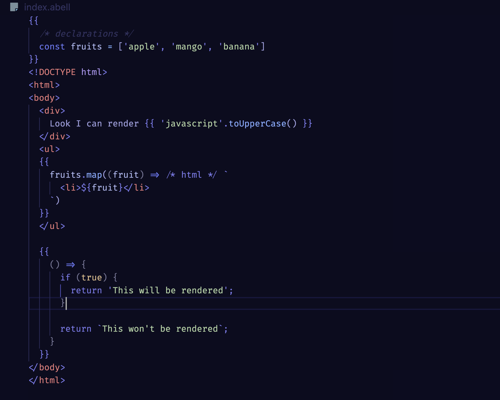

# Abell Language Features

Syntax Highlighting for `.abell` files.

## Features

- Syntax Highlighting for `.abell` files
- Support for HTML blocks inside JavaScript strings inside Abell Blocks
- Support for Abell Components
- AutoComplete Component Names
- AutoComplete important predefined variables of Abell.

## Release Notes

Release notes are mentioned in [CHANGELOG.md](CHANGELOG.md)

---

***Thank You! 🐨🎉***
